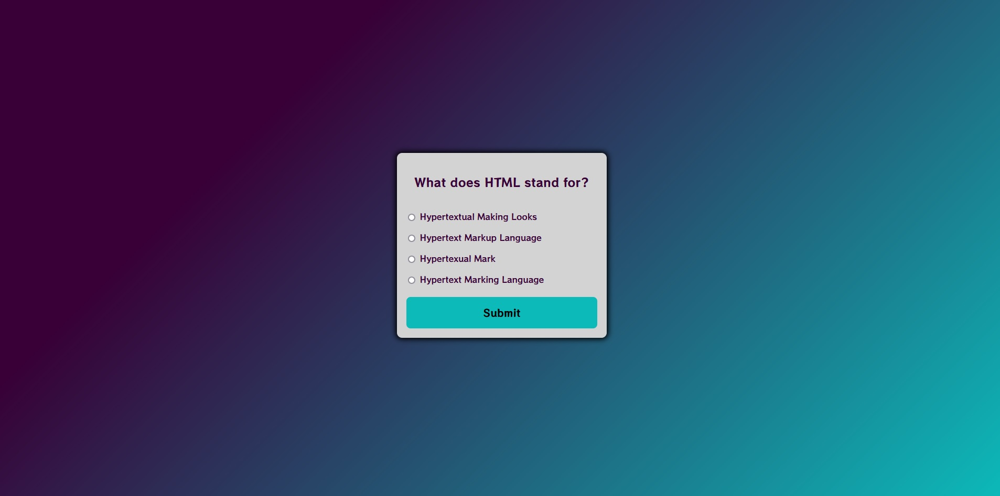
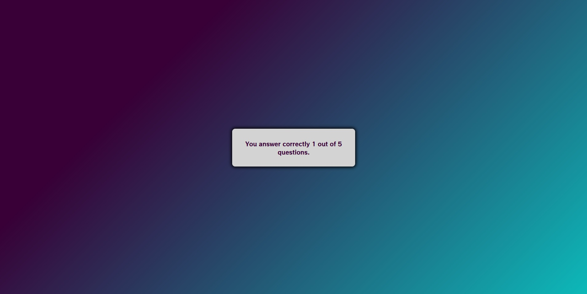

[Back to Portfolio](./)

JavaScript Coding Quiz
===============

-   **Language(s): JavaScript, CSS, HTML**
-   **Source Code Repository:** [Github Link](https://github.com/ckyleflynndev/JS_CodingQuizApp)  
   

## Project description

A short quiz for JavaScript, CSS, and HTML

## How to compiles / run the program

[Codepen.io](https://codepen.io/Ckflynndev/pen/gOWvdOy?editors=0100) link to see it now

## UI Design

Lorem ipsum dolor sit amet (see Fig 1), consectetur adipiscing elit, sed do eiusmod tempor incididunt ut labore et dolore magna aliqua. Ut enim ad minim veniam, quis nostrud exercitation ullamco laboris nisi ut aliquip ex ea commodo consequat (see Fig 2). Duis aute irure dolor in reprehenderit in voluptate velit esse cillum dolore eu fugiat nulla pariatur. Excepteur sint occaecat cupidatat non proident, sunt in culpa qui officia deserunt mollit anim id est laborum (see Fig 3).

Fig 1. The launch screen

Fig 2. Example output after input is processed.

Fig 3. Feedback when an error occurs.

## 3. Additional Considerations

Sed ut perspiciatis unde omnis iste natus error sit voluptatem accusantium doloremque laudantium, totam rem aperiam, eaque ipsa quae ab illo inventore veritatis et quasi architecto beatae vitae dicta sunt explicabo. 

[Back to Portfolio](./)

For more details see [GitHub Flavored Markdown](https://guides.github.com/features/mastering-markdown/) for formatting.

