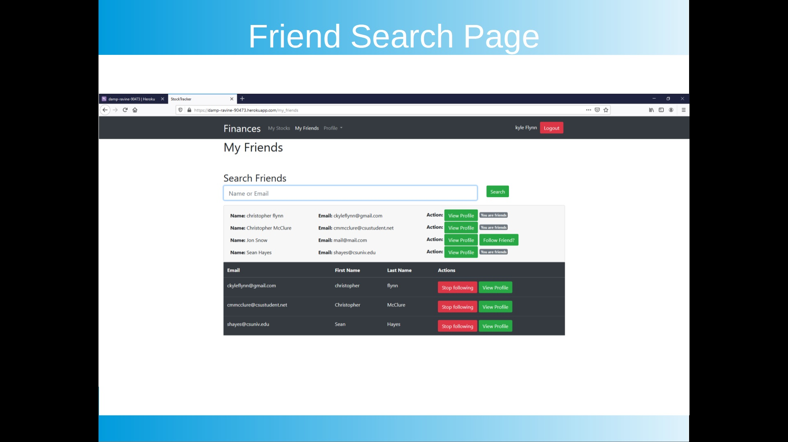
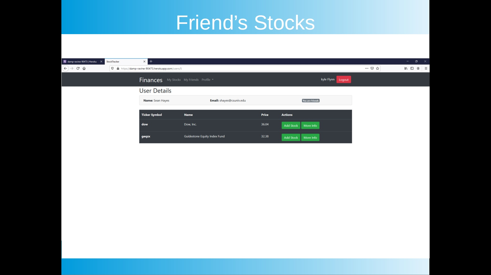
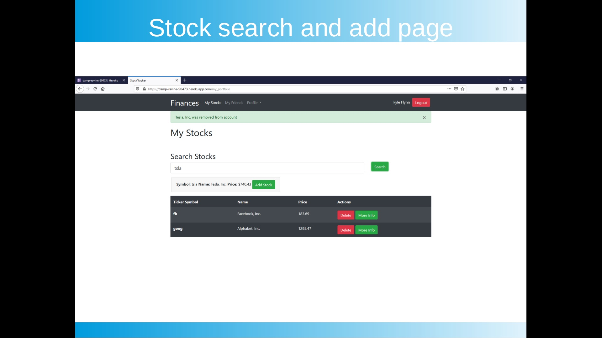

[Back to Portfolio](./)

Stock Market Website
===============

-   **Language(s):** Ruby 2.6.6, Rails 6.0.2.2, Heroku, Devise, Bash, JS, HTML, CSS, Bootstrap, IEX Fiance API, More included in the Gemfile
-   **Source Code Repository:** [features/mastering-markdown](https://github.com/ckyleflynn/newStockApp)  

## Project description

    coming soon

## How to compiles / run the program

No longer connected to webhost and API expired

## UI Design
(see Fig 1)(see Fig 2).(see Fig 3).

    coming soon

Fig 1. 

Fig 2.

Fig 3. 

[Back to Portfolio](./)

For more details see [GitHub Flavored Markdown](https://guides.github.com/features/mastering-markdown/) for formatting.

